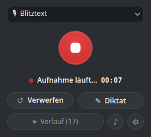
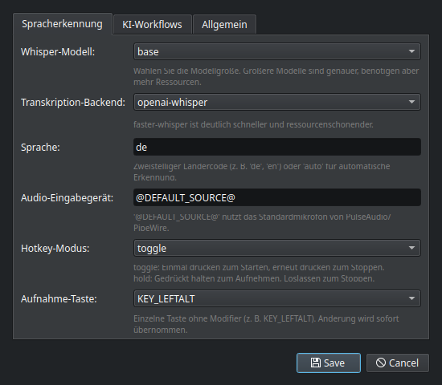
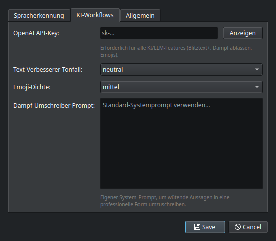
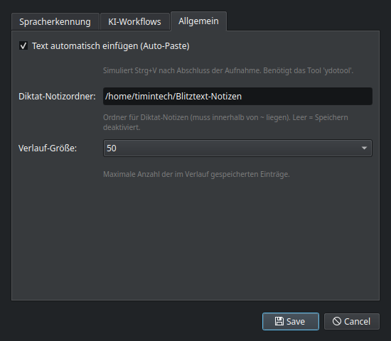
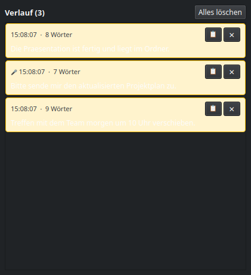
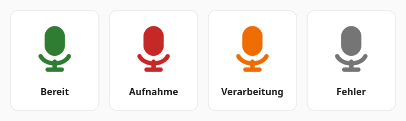

# Blitztext

**Sprache zu Text per Hotkey** — aufnehmen, transkribieren, optional per LLM umschreiben und direkt in die aktive Anwendung einfügen.

Dieses Repository enthält zwei eigenständige Implementierungen:

- 🐧 **[Blitztext Linux](BlitztextLinux/README.md)** — Python 3 / PyQt6, für Kubuntu/Ubuntu unter KDE Plasma mit Wayland. **Im Fokus dieses Forks.**
- 🍎 **[Blitztext macOS](BlitztextMac/README.md)** — das ursprüngliche Swift/SwiftUI-Menubar-Projekt von [cmagnussen](https://github.com/cmagnussen/blitztext-app), unverändert übernommen.

> [!NOTE]
> Dies ist ein Lern- und Experimentier-Projekt: eigenen OpenAI API-Key mitbringen, kein gehostetes Backend, keine Gewährleistung. Die macOS-Version bleibt von der Linux-Portierung vollkommen unberührt.

---

## Screenshots (Linux)

<table>
  <tr>
    <td align="center">
      <br>
      <sub><b>Hauptfenster</b> — bereit (Glass-Dark-Design)</sub>
    </td>
    <td align="center">
      <br>
      <sub><b>Hauptfenster</b> — Aufnahme läuft</sub>
    </td>
  </tr>
  <tr>
    <td align="center">
      <br>
      <sub><b>Einstellungen → Spracherkennung</b></sub>
    </td>
    <td align="center">
      <br>
      <sub><b>Einstellungen → KI-Workflows</b></sub>
    </td>
  </tr>
  <tr>
    <td align="center">
      <br>
      <sub><b>Einstellungen → Allgemein</b></sub>
    </td>
    <td align="center">
      <br>
      <sub><b>Verlauf</b> — Transkripte & Diktat-Einträge</sub>
    </td>
  </tr>
  <tr>
    <td align="center" colspan="2">
      <br>
      <sub><b>Vorlesen</b> — Text-to-Speech via Piper</sub>
    </td>
  </tr>
</table>

---

## Die 5 Workflows

| Workflow | Hotkey | LLM | Beschreibung |
| :--- | :--- | :---: | :--- |
| 🎙 **Blitztext** | `Meta+H` | – | Sprache aufnehmen, transkribieren, direkt einfügen. |
| 🔒 **Blitztext Lokal** | `Meta+Shift+H` | – | Rein lokale Transkription, ohne Internet. |
| ✨ **Blitztext+** | `Meta+Shift+T` | ✓ | Transkript per GPT-4o-mini sauber umformulieren. |
| 🔥 **Blitztext $%&!** | `Meta+Shift+D` | ✓ | Emotionale Sprache in eine sachliche Nachricht wandeln. |
| 😊 **Blitztext :)** | `Meta+Shift+E` | ✓ | Passende Emojis ergänzen (Dichte einstellbar). |

Dazu Komfort-Funktionen: **Diktat-Modus** (Markdown-Notizen), **Verlauf** (Kopieren/Löschen/Zusammenführen), **Vorlesen** (Piper TTS) und Desktop-**Benachrichtigungen**.

---

## Status auf einen Blick — Tray-Symbol

Das Mikrofon-Symbol im System-Tray signalisiert über seine Farbe den aktuellen Zustand:

<p align="center">
  
</p>

| Farbe | Zustand | Bedeutung |
| :---: | :--- | :--- |
| 🟢 **Grün** | Bereit (IDLE) | Wartet auf Hotkey oder Klick. |
| 🔴 **Rot** | Aufnahme | Mikrofon nimmt gerade auf. |
| 🟠 **Orange** | Verarbeitung | Transkription bzw. LLM-Umschreibung läuft. |
| ⚪ **Grau** | Fehler | Letzter Vorgang ist fehlgeschlagen. |

---

## Schnellstart (Linux)

```bash
# Systempakete
sudo apt install pulseaudio-utils wl-clipboard ydotool ffmpeg python3-venv python3-evdev socat

# Lokale Whisper-Engine
pipx install openai-whisper

# Projekt aufsetzen
cd BlitztextLinux
python3 -m venv .venv
.venv/bin/pip install PyQt6 evdev openai pytest

# evdev-Rechte (danach ab- und wieder anmelden)
sudo usermod -aG input $USER

# Starten
./run.sh
```

Die **vollständige Anleitung** — Voraussetzungen, ydotool-Setup, Konfiguration, systemd-Autostart, Tests, Sicherheits- und Datenschutz-Hinweise — steht in **[BlitztextLinux/README.md](BlitztextLinux/README.md)**.

---

## macOS-Version

Der ursprüngliche macOS-Menubar-Client liegt unverändert unter **[BlitztextMac/](BlitztextMac/README.md)** und stammt aus dem Upstream-Projekt von [cmagnussen/blitztext-app](https://github.com/cmagnussen/blitztext-app). Build und Nutzung sind dort dokumentiert.

---

## Lizenz

Code unter der MIT-Lizenz — siehe [LICENSE](LICENSE). Projektnamen, Logos und App-Icons sind davon nicht automatisch als Marken-/Brand-Assets erfasst — siehe [TRADEMARKS.md](TRADEMARKS.md).

Begleitende Website (blitztext.de) betrieben von Blackboat Internet GmbH:
[Impressum](https://www.blackboat.com/impressum) · [Datenschutz](https://www.blackboat.com/datenschutz)
